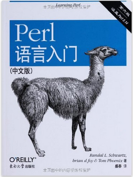
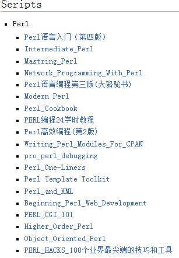

## 前提
* 假设是看过"Perl入门"这本书



##Perl coding tips

### 打开pipe或者访问文件的时候，最好使用die

```perl
open FILE, "a_file" or die "Can not open file a_file: $!";
close FILE;
```

### 比die更好用的是croak

```perl
use Carp;
a("a_file"); #假设a_file存在
a("b_file"); #假设b_file不存在
sub a {
      my $filename = shift;
      open FILE, "$filename" or croak "Can not open file $filename: $!";
      return 0;
}
```

### 用dumper来print复杂的数据结构，便于debug

```perl
use Data::Dumper;

$var = {"name" => "hello", "action" => "speak" };
print Dumper($var);
```
### 用grep和map可以节省很多代码

```perl
my @foos = grep {!/^#/} @bars;    # weed out comments

my %hash = map {  lc($_) => 1  } @array

my @squares = map { $_ * $_ } grep { $_ > 5 } @numbers;
```

### 使用qq代替双引号，使用q代替单引号，list赋值使用qw

```perl
$a = qq{"}; #{}只是边界作用
$b = qq!"!; #和上面是一样的

$c = q{'};
@vars = qw{a b c};
```

### 使用list的内置函数，不要重新发明轮子

```perl
use List::Util qw(max);

my @vars = qw(1 2 3);
my $result = max(@vars);
```

### 打印多行的信息

```perl
$a = "hello";
print <<ENDOFPRINT;
Dear Lee,
    blablabla...
    $a
ENDOFPRINT

$b = <<ENDOFA;
Dear friend,
   I am here.
ENDOFA
```

### 只想做语法检查

```shell
perl -cwT test.pl
```

### 查看Perl默认的include路径

```shell
perl -e "print join(qq{\n}, @INC)"
```

### 使用自己的local路径下的库

```perl
use lib '/home/xx/eda_scripts/pm';
```
### 查看perl的pod格式的说明

```shell
perldoc rvp.pm
perldoc perldoc
```

### Perl5.8之后的版本，可以在数据中间加下划线

```perl
$a = 111_222;
print "a = ", $a , "\n";
```

### 调用其他shell命令，同时获得shell命令的STDERR以及STDOUT信息

```perl
$pid = open $readme, "-|", "$cmd 2>&1";
while (<$readme>) {
    push(@out, $_);
}
close $readme;
```

### Perl使用子线程，获得子线程的STDERR信息

```perl
pipe(READER, WRITER) or die "pipe no good: $!";
my $pid = fork();
die "Can no fork: $!" unless defined $pid;
if($pid) { #parent process
    close WRITER;
    while(<READER>) {
        push @out, $_;
    }    
}
else { #child process
    close READER;
    open STDERR, ">&WRITER";
    $parser = XML::LibXML->new;
    $parser->validation(1);
    exit 0;
}
```

### 多线程

* 因为fork是复制出一个完全一样的进程，所以“go on”会被print 2 次。

```perl
my $pid = fork();
if($pid) {
    #parent
    print "in parent\n";
}
else {
    #child
    print "in child\n";
}
print "go on\n";
```

* child process中途退出了，所以 “go on”只被print 1次。

```perl
my $pid = fork();
if($pid) {
    #parent
    print "in parent\n";
}
else {
    #child
    print "in child\n";
    exit;
}
print "go on\n";
```

* child process通过exec，替换掉当前process，所以 “never print this”不会被print。

```perl
my $pid = fork();

if($pid) {
    #parent
    print "in parent\n";
}
else {
    #child
    print "in child\n";
    exec("ls");
    print "never print this.\n";
}
print "go on\n";
```

* eval{}是一种保护性写法。eval的运行结果放在$@里。可以结合alarm handler来完成很多应用。

```perl
print STDERR "type your password: ";
my $password =
eval {
local $SIG{ALRM} = sub { die "timeout\n" };
alarm (5); # five second timeout
return <STDIN>;
};
alarm (0);
print STDERR "you timed out\n" if $@ =~ /timeout/;
```

* reaper函数，非阻塞式（WNOHANG）的处理所有子进程，$kid等于-1的时候，表示没有需要回收的进程，跳出reaper函数

```perl
use POSIX 'WNOHANG';
$SIG{CHLD} = \&reaper;
sub reaper {
    while ((my $kid = waitpid(-1,WNOHANG)) > 0) {
    warn "Reaped child with PID $kid\n";
    }
}
```

### reference
* 类似c语言的指针

```perl
@vars = ();
$vars_ref = \@vars;

$a_href = {};
$b_href = { "name" => "b", "action" => "speak", };
$c_href = {%{$b_href}};


$tmp = "name";
print $c_href->{$tmp}, "\n"; #This is called a symbolic reference
```

### 安装module
```shell
cpan install Template
cpan install XML::Rabbit #反应了目录层次
```

### 好用的module

* [Template](http://template-toolkit.org/docs/)
* [XML::LibXML](http://search.cpan.org/~shlomif/XML-LibXML-2.0125/LibXML.pod)
* [XML::Rabbit](http://search.cpan.org/~robins/XML-Rabbit-0.4.1/lib/XML/Rabbit.pm)
* [rvp](http://www.burbleland.com/v2html/rvp.html)
* [Smart::Comments](http://search.cpan.org/~neilb/Smart-Comments-1.06/lib/Smart/Comments.pm)
* [Moose](http://search.cpan.org/~ether/Moose-2.1802/lib/Moose.pm)

## Perl 在我们验证中的应用
* 先说其他人的应用
  * [easier UVM](http://www.doulos.com/content/events/easierUVM.php)


## Perl 参考书目，以及推荐阅读顺序


## Perl 参考网站

[perldoc.perl.org](http://perldoc.perl.org/)

[cpan](http://search.cpan.org/)


